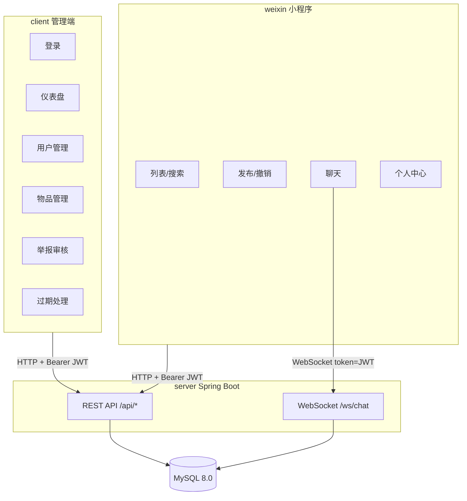

# 校园失物招领系统（毕设）项目说明文档

> 用途：复试简历撰写 + 现场答辩/提问准备  
> 项目结构：`weixin/`（用户端小程序）+ `server/`（Spring Boot 后端）+ `client/`（Vue3 管理端）

---

## 1. 项目概述（你怎么一句话讲清楚）

这是一个 **校园失物招领系统**，面向两类角色：

- **普通用户（微信小程序）**：浏览/搜索失物与招领信息、发布信息、撤销、留言、私信联系发布者、上传图片（识别接口预留）。
- **管理员（Web 管理端）**：用户管理（封禁/解封）、失物/招领信息管理、举报审核、过期信息处理、数据可视化统计。

后端提供统一 REST API，并用 WebSocket 支持实时聊天。

---

## 2. 技术栈与选型理由（复试常问）

### 2.1 后端（`server/`）

- **Spring Boot 4 + Spring WebMVC**：快速搭建 REST API，约定优于配置，工程化成熟。
- **Spring Data JPA（Hibernate）**：实体映射 + Repository 简化 CRUD；结合 Specification 做多条件查询。
- **Spring Security + JWT**：无状态认证，适配小程序与管理端；RBAC（USER/ADMIN）做后台权限隔离。
- **WebSocket**：实现用户私信实时推送，体验比轮询更好。
- **MySQL 8.0**：事务型关系数据库，支持全文索引与 JSON 字段。

### 2.2 用户端小程序（`weixin/`）

- **原生小程序**：适配微信生态、登录与消息能力；UI 用卡片化布局与主题色统一设计。
- **封装 `wx.request` + JWT 自动携带**：减少页面重复代码，提高可维护性。

### 2.3 管理端（`client/`）

- **Vue 3 + Vite**：组合式 API 更易组织复杂页面逻辑；Vite 开发构建快。
- **Pinia**：轻量状态管理，持久化 token/userInfo。
- **Element Plus**：后台页面组件成熟，表格/弹窗/分页开箱即用。
- **ECharts**：仪表盘可视化（分类分布饼图、近 7 日趋势折线图）。

---

## 3. 系统架构与数据流（答辩讲故事用）



---

## 4. 数据库设计（6 张表如何覆盖业务）

建表与测试数据在：
- `server/src/main/resources/sql/schema.sql`
- `server/src/main/resources/sql/data.sql`

### 4.1 表与关系

- **user**：普通用户（openid）+ 管理员（username/password/role=ADMIN）
- **item_category**：物品分类（证件卡类/电子产品/钥匙…）
- **item**：失物/招领统一存储（`type=0/1`），状态流转（寻找中/已找回/已撤销/已过期）
- **message**：私信消息（sender/receiver + 未读）
- **item_comment**：物品留言（挂到 item）
- **report**：举报（可举报用户/物品，后台审核）

关键设计点（复试可讲）：

1. **失物与招领共表**：用 `item.type` 区分，减少重复字段与接口数量，列表筛选更简单。
2. **图片用 JSON 数组**：`item.images` 存 `List<String>`（URL 列表），发布时可多图；更贴近前端使用习惯。
3. **外键删除策略**：
   - 物品属于用户：`item.user_id` 外键 `ON DELETE CASCADE`（用户删掉，发布数据随之清理）。
   - 举报关联物品/用户：使用 `ON DELETE SET NULL`，防止因被举报对象删除导致举报记录丢失。
4. **全文索引**：`item(title, description)` 建 `FULLTEXT`，为“关键词搜索”预留性能优化空间（当前业务层也做了 like 搜索）。

---

## 5. 后端实现细节（按模块拆讲）

### 5.1 统一返回与异常处理

- **统一返回结构**：`CommonResponse<T>`（`code/message/data`）  
  文件：`server/src/main/java/com/example/server/dto/CommonResponse.java`
- **业务异常**：`BusinessException` + `GlobalExceptionHandler` 统一转 JSON  
  文件：`server/src/main/java/com/example/server/exception/*`

你可以这样回答“为什么要统一返回？”：
> 前端可以只写一套错误处理逻辑，接口风格稳定，便于后续接入拦截器/日志/监控；同时避免把堆栈暴露给前端。

### 5.2 登录与鉴权（小程序 + 管理端）

#### 5.2.1 小程序登录（openid + JWT）

- 接口：`POST /api/auth/wx-login`
- 实现：`AuthService#wxLogin`  
  文件：`server/src/main/java/com/example/server/service/AuthService.java`

核心逻辑：
1. 以前端传来的 openid 为主键来源，`userRepository.findByOpenid` 查不到则创建新用户（role=USER）。
2. 生成 JWT：`JwtUtil.generateToken(userId, role)`。
3. 封禁校验：`status==1` 返回 403。

> 说明：当前小程序端为了演示使用了 mock openid（`weixin/utils/auth.js`），真实上线应使用 `wx.login` 的 `code` 到后端换取 openid（可在复试中主动说“这里预留了真实接入方案”）。

#### 5.2.2 管理员登录（账号密码 + JWT）

- 接口：`POST /api/auth/admin-login`
- 校验：BCrypt 密码匹配（`PasswordEncoder.matches`）
- 仅 role=ADMIN 才允许

#### 5.2.3 JWT 过滤器与权限控制

文件：`server/src/main/java/com/example/server/security/JwtAuthFilter.java`

工作流程：
1. 从 `Authorization: Bearer <token>` 取 token。
2. `JwtUtil.validateToken` 校验签名与过期。
3. 把 `userId` 放到 `SecurityContext`，并 `request.setAttribute("userId", userId)`，供 Controller 直接取用。

安全策略（重点可背）在 `SecurityConfig`：

```25:46:c:/Users/34306/Desktop/lost_found/server/src/main/java/com/example/server/config/SecurityConfig.java
@Bean
public SecurityFilterChain filterChain(HttpSecurity http) throws Exception {
    http
            .csrf(AbstractHttpConfigurer::disable)
            .cors(cors -> {})
            .sessionManagement(s -> s.sessionCreationPolicy(SessionCreationPolicy.STATELESS))
            .authorizeHttpRequests(auth -> auth
                    .requestMatchers("/api/auth/**").permitAll()
                    .requestMatchers("/uploads/**").permitAll()
                    .requestMatchers("/ws/**").permitAll()
                    .requestMatchers("/api/admin/**").hasRole("ADMIN")
                    .requestMatchers("/api/**").authenticated()
                    .anyRequest().permitAll())
            .addFilterBefore(jwtAuthFilter, UsernamePasswordAuthenticationFilter.class);
    return http.build();
}
```

复试加分点（可主动讲）：
- 为什么管理端接口单独前缀 `/api/admin`：更清晰的权限边界，便于网关/日志隔离与后续微服务拆分。

### 5.3 失物/招领信息管理（发布、浏览、筛选、撤销、状态）

#### 5.3.1 发布

接口：`POST /api/items`  
Controller：`ItemController#create`  
DTO：`ItemCreateRequest`（`@Valid`）  
Service：`ItemService#create`

物品字段覆盖需求：时间/地点/名称/类型/描述/图片/联系方式/状态等。

#### 5.3.2 列表查询（关键词 + 分类 + 类型 + 状态 + 分页）

接口：`GET /api/items?keyword&categoryId&type&status&page&size`  
实现：`ItemService#list` 使用 **JPA Specification** 动态拼接条件：
- 关键词对 `title/description/location` 做 like
- category/type/status 条件可选
- 默认只显示 `status=0`（寻找中）

这点常被问“为什么不用写死 SQL？”你可以答：
> Specification 适合多条件组合查询，避免 if-else 拼 SQL；并且仍能利用 JPA 的分页、排序与类型安全。

#### 5.3.3 撤销/状态流转

接口：`PUT /api/items/{id}/status?status=2`
- 业务：只能操作自己发布的 item（`item.user.id == userId`）
- 状态：0 寻找中 / 1 已找回 / 2 已撤销 / 3 已过期

#### 5.3.4 我的发布

接口：
- `GET /api/items/my/lost`
- `GET /api/items/my/found`

用于个人中心查看自己发布的状态列表。

### 5.4 留言系统（物品详情页评论）

接口：
- `GET /api/items/{id}/comments`
- `POST /api/items/{id}/comments`（JSON body：`{content}`）

关键规则：**物品状态不是寻找中（status!=0）时禁止留言**，避免“结束信息仍被刷留言”。

### 5.5 私信聊天（HTTP 会话列表 + WebSocket 实时收发）

#### 5.5.1 HTTP：会话列表/历史消息/未读数

- `GET /api/messages/conversations`：按“对话对象”聚合最后一条消息 + 未读数
- `GET /api/messages/conversation/{otherUserId}`：拉取历史并标记已读
- `GET /api/messages/unread-count`：个人中心显示未读数

#### 5.5.2 WebSocket：实时聊天

注册：`/ws/chat`（`WebSocketConfig`）  
处理类：`ChatWebSocketHandler`

核心实现（复试可讲 3 点）：
1. **鉴权**：连接 URL 携带 `token`（JWT），服务端校验通过才允许建立连接。
2. **在线会话管理**：`ConcurrentHashMap<Long, WebSocketSession>` 保存 userId->session。
3. **可靠性**：消息先落库（message 表），再向双方推送；对方不在线时仍可在下次拉历史看到。

关键代码（可引用）：

```34:84:c:/Users/34306/Desktop/lost_found/server/src/main/java/com/example/server/websocket/ChatWebSocketHandler.java
public void afterConnectionEstablished(WebSocketSession session) throws Exception {
    String token = getTokenFromSession(session);
    if (token == null || !jwtUtil.validateToken(token)) {
        session.close(CloseStatus.NOT_ACCEPTABLE);
        return;
    }
    Long userId = jwtUtil.getUserId(token);
    SESSIONS.put(userId, session);
}

protected void handleTextMessage(WebSocketSession session, TextMessage message) throws Exception {
    // 解析 JSON -> 落库 -> 推送给 sender 与 receiver（若在线）
}
```

可拓展点（面试时主动说）：当前是单机内存会话表，若要上生产需改为 Redis/消息队列 + 多实例广播或 STOMP。

### 5.6 图片上传与识别（Mock）

#### 5.6.1 上传

- 接口：`POST /api/image/upload`（MultipartFile）
- `ImageService#save`：UUID 文件名，写到 `upload.path`，返回 `/uploads/{file}`
- `WebMvcConfig` 将 `/uploads/**` 映射到本地目录，供前端直接访问

#### 5.6.2 识别（Mock）

- 接口：`POST /api/image/recognize?imageUrl=...`
- 当前返回固定候选分类（预留接入第三方图像识别 API）

### 5.7 举报系统（提交 + 审核）

- 用户提交：`POST /api/reports`
  - 必须举报“用户或物品”之一
  - 初始状态 `status=0` 待审核
- 管理端审核：
  - `PUT /api/admin/reports/{id}/approve?note=...`
  - `PUT /api/admin/reports/{id}/reject?note=...`

### 5.8 管理端统计与过期处理

#### 5.8.1 仪表盘统计（/api/admin/stats）

接口：`GET /api/admin/stats`  
Service：`AdminService#getStats`  
前端页面：`client/src/views/Dashboard.vue`

统计字段包括：
- `totalUsers`：用户总数
- `totalItems`：物品总数
- `lostCount/foundCount`：失物/招领数量
- `todayItems`：今日新增（按 createdAt 统计）
- `pendingReports`：待审核举报数
- `categoryDistribution`：分类分布（饼图数据）
- `recentTrend`：近 7 日趋势（折线图数据）

说明（复试可讲“可视化怎么做的”）：
- 后端返回图表所需的结构化数据；
- 管理端用 ECharts 渲染饼图和折线图（见 `client/src/views/Dashboard.vue`）。

#### 5.8.2 过期处理（批量把长期未找回的 item 标记为过期）

接口：`POST /api/admin/items/expire?days=30`  
实现：`AdminService#expireOldItems(days)` 以 `createdAt < now-days` 且 `status==0` 的物品为目标，更新为 `status=3`（已过期）。

> 可扩展：更严谨的“过期”规则可以按 `event_time` 或配置化策略，并配合定时任务（@Scheduled）自动执行。

---

## 6. 微信小程序端实现细节（`weixin/`）

### 6.1 页面结构与导航

核心页面在 `weixin/app.json` 中声明，TabBar 四个入口：
- `pages/index/index`：失物/招领列表（浏览、搜索、筛选）
- `pages/publish/publish`：功能入口（发布失物、发布招领、撤销）
- `pages/chat-list/chat-list`：会话列表
- `pages/profile/profile`：个人中心

其它功能页：
- `pages/item-detail/item-detail`：物品详情（图片/描述/留言/联系发布者）
- `pages/publish-item/publish-item`：发布表单（多图上传）
- `pages/my-lost/my-lost`、`pages/my-found/my-found`：我的发布列表（撤销）
- `pages/chat/chat`：聊天
- `pages/login/login`：登录页

### 6.2 请求封装与 JWT 自动携带

文件：`weixin/utils/request.js`

核心点：
- 统一拼接后端域名 `API_BASE`
- 自动带 `Authorization: Bearer <token>`
- 遇到 401 自动清理缓存并跳转登录页

### 6.3 登录流程

页面：`weixin/pages/login/login.*`  
封装：`weixin/utils/auth.js`

流程：
1. 点击“一键登录” -> 调用 `wx.login`；
2. 请求后端 `/api/auth/wx-login` 获取 token 与用户信息；
3. `wx.setStorageSync('token')`、`wx.setStorageSync('userInfo')`，然后 `reLaunch` 到首页。

> 说明：目前为了本地演示使用 mock openid；真实接入应在后端用 `code` 换取 openid 并签发 JWT（复试可主动说明改造点）。

### 6.4 失物/招领列表（首页）

页面：`weixin/pages/index/index.js`

实现要点：
- `loadCategories()` 拉取分类（`/api/categories`）
- `loadItems(refresh)` 拉取分页列表（`/api/items`）
- 支持参数：`keyword/categoryId/type`
- 触底加载：`onReachBottom` 继续拉下一页

### 6.5 发布信息（含图片上传）

入口页：`weixin/pages/publish/publish.*`  
表单页：`weixin/pages/publish-item/publish-item.*`

发布流程：
1. `picker` 选择分类；
2. `wx.chooseMedia` 选图（最多 9 张）；
3. `wx.uploadFile` 上传到后端 `/api/image/upload`，得到图片 URL 列表；
4. `POST /api/items` 提交发布（包含 `images[]`）。

### 6.6 撤销信息

页面：`my-lost` / `my-found`  
接口：`PUT /api/items/{id}/status?status=2`

实现：只有 `status==0`（寻找中）才允许撤销，撤销后列表显示“已撤销”状态。

### 6.7 留言与联系发布者

页面：`item-detail`
- 详情：`GET /api/items/{id}`
- 留言列表：`GET /api/items/{id}/comments`
- 发表评论：`POST /api/items/{id}/comments`（JSON）
- 联系：跳转聊天页 `pages/chat/chat?userId=发布者ID`

### 6.8 聊天（HTTP 历史 + WebSocket 实时）

会话列表：`chat-list` 调 `/api/messages/conversations`  
聊天页：`chat` 页面逻辑：
1. 先拉历史 `GET /api/messages/conversation/{otherUserId}`；
2. 再连接 WebSocket：`/ws/chat?token=<JWT>`；
3. 发送消息 `sendMessage({receiverId, content, msgType})`；
4. 收到消息后按对话对象过滤并追加到列表。

---

## 7. Vue3 管理端实现细节（`client/`）

### 7.1 工程与依赖

- 路由：`vue-router`（`client/src/router/index.js`）
- 状态：`pinia`（`client/src/stores/user.js`）
- UI：`element-plus` + `@element-plus/icons-vue`
- HTTP：`axios`（封装在 `client/src/utils/request.js`）
- 图表：`echarts`（`Dashboard.vue` 直接 `echarts.init`）
- 开发代理：`client/vite.config.js` 将 `/api` 代理到 `http://localhost:8080`

### 7.2 登录与路由守卫

登录页：`client/src/views/Login.vue`  
接口：`POST /api/auth/admin-login`  
成功后 `userStore.setAuth(res.data)`，保存 token/userInfo 到 localStorage。

路由守卫（关键点）：未登录访问后台页面会被重定向到 `/login`：

```22:27:c:/Users/34306/Desktop/lost_found/client/src/router/index.js
router.beforeEach((to, from, next) => {
  const store = useUserStore()
  if (to.meta.requiresAuth && !store.isLoggedIn()) next('/login')
  else if (to.meta.guest && store.isLoggedIn()) next('/')
  else next()
})
```

### 7.3 后台布局与通用交互

布局：`client/src/layout/AdminLayout.vue`
- 左侧菜单：仪表盘/用户/物品/举报/过期
- 右侧：顶部标题 + 用户下拉退出 + 主体 router-view

通用交互模式：
- 列表页统一 `el-table + el-pagination`
- 操作统一 `ElMessageBox.confirm/prompt` 二次确认
- 操作成功 `ElMessage.success` 并 reload

### 7.4 各页面功能对应

- **Dashboard.vue**：统计卡片 + 饼图/折线图（对接 `/api/admin/stats`）
- **UserManage.vue**：用户搜索、封禁/解封（`PUT /api/admin/users/{id}/ban`）
- **ItemManage.vue**：按类型/状态筛选，支持删除（`DELETE /api/admin/items/{id}`）
- **ReportManage.vue**：举报审核，通过/驳回带备注（approve/reject）
- **ExpiredManage.vue**：指定天数批量过期（`POST /api/admin/items/expire`）

---

## 8. 复试可能问题（含参考回答）

下面的问题按“常见考察点”组织，你可以根据面试节奏选讲深浅。

### Q1：为什么要做三端（小程序+管理端+后端）？不做单体页面行不行？
**答**：三端对应不同使用场景和权限边界：普通用户用小程序更便捷；管理员需要 Web 表格/审核/统计；后端统一提供数据和权限控制，便于扩展与维护。把管理能力混到小程序会导致权限与界面复杂度显著上升。

### Q2：为什么用 JWT？它的工作原理是什么？
**答**：JWT 是无状态令牌，服务端不存 session。登录成功后服务端签发 token（包含 userId、role），前端每次请求带 `Authorization: Bearer token`，后端过滤器校验签名与过期并解析出 userId 注入上下文。适合小程序/前后端分离场景。

### Q3：Spring Security 里你是怎么做接口鉴权的？
**答**：在 `SecurityConfig` 配路径规则：`/api/auth/**` 放行，`/api/admin/**` 需 ADMIN，其他 `/api/**` 需登录；`JwtAuthFilter` 解析 token 并注入 `ROLE_` 权限，同时把 userId 放进 request attribute 给 Controller 使用。

### Q4：管理员密码如何安全存储？你为什么用 BCrypt？
**答**：管理员密码用 BCrypt 哈希保存，避免明文泄露。BCrypt 自带盐并可调计算成本，能抵抗彩虹表/暴力破解；登录用 `matches` 对比。

### Q5：失物和招领为什么设计成一张表？
**答**：字段高度一致，用 `type` 区分能减少冗余；列表筛选、统计与管理也更简单。若未来差异增大再考虑拆表或增加扩展字段/表。

### Q6：关键词搜索你怎么做的？如何优化？
**答**：当前用 Specification 拼 like（title/description/location）。数据库层也建了 FULLTEXT 索引（`ft_title_desc`），后续可切 `MATCH AGAINST` 或引入 ES 做更强检索。

### Q7：为什么用 JPA Specification？
**答**：多条件组合查询非常适合 Specification，避免手写大量 SQL 和拼接 bug，同时复用 JPA 分页/排序。

### Q8：聊天为什么用 WebSocket？不用轮询可以吗？
**答**：轮询延迟高、浪费流量且压力大。WebSocket 长连接可实时推送；我的实现：连接时校验 JWT、在线 session 用 map 管理、消息先落库再推送。

### Q9：WebSocket 在线用户表为什么用 ConcurrentHashMap？有哪些局限？
**答**：ConcurrentHashMap 线程安全、访问快，适合单机毕设。局限：多实例部署无法共享在线状态，需 Redis/消息队列做广播或 STOMP。

### Q10：未读消息怎么统计？
**答**：message 表有 `is_read`，拉历史时把 receiver 是自己且未读的消息标记已读；未读数直接 count。

### Q11：如何防止越权（比如别人撤销你的物品）？
**答**：在 Service 层校验发布者 id 与 token 的 userId 一致，否则返回 403。管理员操作走 `/api/admin/**` 并由 Spring Security 限制角色。

### Q12：举报系统你怎么设计状态流转？
**答**：report 初始 `status=0` 待审核，管理员通过为 1、驳回为 2，并可记录 `admin_note`。关联的用户/物品采用 SET NULL 保留历史。

### Q13：图片为什么存文件而不是存数据库？
**答**：图片存文件/对象存储，数据库只存 URL，性能更好、扩容更容易；后续可换 OSS/COS + CDN。

### Q14：小程序端如何做到请求自动带 token？
**答**：封装 `weixin/utils/request.js`，内部统一添加 Authorization；401 统一处理并跳登录，页面只写业务代码。

### Q15：管理端如何做登录态与路由保护？
**答**：Pinia store 持久化 token；路由守卫判断 `requiresAuth`，未登录跳 `/login`，避免直接访问受保护页面。

### Q16：你如何保证数据一致性？
**答**：关键写操作放在 Service 层，必要时 `@Transactional`；外键约束保证引用一致性；删除策略用 CASCADE/SET NULL 防止脏数据。

### Q17：如果数据量变大，你会怎么优化列表与统计？
**答**：索引覆盖分页与筛选字段；关键词用全文索引；统计接口改为数据库聚合 SQL + 缓存；热点列表可加 Redis。

### Q18：你项目里有哪些可扩展点？
**答**：图片识别是 Mock，随时可接第三方；WebSocket 可做分布式；过期处理可加定时任务；微信登录可由 mock 改为真实 code->openid。

### Q19：如果重做一次你会改进什么？
**答**：登录接入真实 openid；聊天引入会话表减少聚合开销；统计改 SQL 聚合并加缓存；增加 traceId/审计日志与更细粒度权限。

### Q20：你在这个项目中最能体现你能力的点是什么？
**答**：三端联调闭环（鉴权+业务+UI），尤其是 JWT 安全链路、WebSocket 实时聊天（落库+推送）、后台审核与数据可视化。

---

## 9. 简历可用项目描述（可直接粘贴）

**校园失物招领系统（毕设）｜Spring Boot 4 / MySQL 8 / Vue3 / 微信小程序 / JWT / WebSocket**  
独立完成三端分离的校园失物招领平台：微信小程序支持失物/招领信息浏览检索、发布与撤销、多图上传、留言互动、私信聊天；后台管理端基于 Vue3 + Element Plus 实现用户封禁/解封、物品信息管理、举报审核、过期信息处理，并用 ECharts 展示分类分布与近 7 日趋势。后端采用 Spring Boot + JPA，基于 Spring Security + JWT 实现无状态认证与 RBAC 权限控制，WebSocket 实现实时聊天并将消息持久化到 MySQL；图片上传采用本地文件存储 + 静态资源映射，图像识别接口以 Mock 形式预留对接第三方 AI 服务。

---

## 10. 复试现场推荐讲述顺序（30-60 秒）

1. **一句话**：校园失物招领系统，三端分离，小程序面向用户，Web 面向管理员。  
2. **技术亮点**：Spring Security + JWT 无状态鉴权；WebSocket 私信实时聊天（消息落库+推送）。  
3. **业务闭环**：发布（含多图）→ 列表筛选/搜索 → 详情留言 → 私信联系 → 举报/后台审核 → 过期处理与统计。  
4. **可扩展**：真实微信 code 登录、图片识别接入、WebSocket 分布式化、统计 SQL 优化与缓存。  

